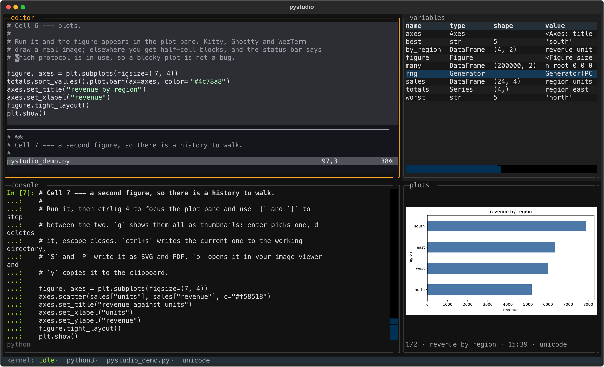

# pystudio

A terminal IDE for Python data science: a mix of RStudio and Jupyter, with a real
Neovim as the editor.



Four panes, one Jupyter kernel, one screen. Works over SSH, no browser.

The editor is not a reimplementation. pystudio spawns `nvim --embed` and attaches
to it as a UI, so your `init.lua`, plugins, LSP, treesitter, macros and registers
all behave exactly as they do in your daily editor. Send a line to the kernel and
the result appears in the console, the variable explorer updates, and figures
land in the plot pane.

## Requirements

- Python 3.12 or newer
- Neovim 0.10 or newer on `PATH`
- A terminal with Kitty graphics or Sixel for real plots (Kitty, Ghostty,
  WezTerm, iTerm2). Everything else falls back to half-cell blocks, and the
  status bar names the protocol in use.

## Install and run

Install the `pystudio` command straight from GitHub:

```sh
uv tool install git+https://github.com/e-riveras/pystudio    # or: pipx install git+https://github.com/e-riveras/pystudio
pystudio analysis.py
```

Each [release](https://github.com/e-riveras/pystudio/releases) also has a wheel
attached, which `uv tool install` or `pipx install` take as a path.

To look around first, take [the guided tour](#the-guided-tour). It plots, so
install pystudio with what the tour imports:

```sh
uv tool install "pystudio-tui[demo] @ git+https://github.com/e-riveras/pystudio"
pystudio --demo
```

pystudio has two AI features, and both are off by default: nothing is sent
anywhere, no agent is started, and their dependencies are not installed. To
have them, install the extras and ask for them when you start:

```sh
uv tool install "pystudio-tui[ai] @ git+https://github.com/e-riveras/pystudio"
pystudio analysis.py --assistant --agent
```

`[assistant]` and `[agent]` install one each; `[ai]` is both. `--assistant`
turns on [the assistant](#the-assistant) and `--agent` turns on
[the agent pane](#the-agent-pane). Setting `PYSTUDIO_ASSISTANT=anthropic` or
`PYSTUDIO_AGENT=claude` in your shell profile does the same without the flag.
Without them, `ctrl+g a` and `ctrl+g c` only say how to turn the feature on.

Options: `--clean` starts Neovim without your config, `--nvim PATH` picks a
different Neovim, `--python PATH` picks the kernel's interpreter, and
`--kernel NAME` uses a registered Jupyter kernel instead.

## Which Python runs your code

pystudio is installed in its own isolated environment, so the kernel looks for
your project's environment first. The first match wins:

1. `--python PATH`
2. `--kernel NAME`, a registered Jupyter kernel
3. the active virtualenv, `$VIRTUAL_ENV`
4. the nearest `.venv` in the opened file's directory or any parent
5. pystudio's own Python, which has none of your packages

The project's environment needs `ipykernel`. Without it pystudio falls back to
its own Python and says so in the console. Add it once per project:

```sh
uv add --dev ipykernel    # or: pip install ipykernel
```

The status bar shows which environment the kernel is running in.

Jupyter signs kernel messages but does not encrypt them, so pystudio starts its
kernel on Unix domain sockets in a directory only you can enter, not on TCP
ports. Nobody else on the machine can read your output, and nothing listens on
the network.

`ctrl+g k` changes it without leaving: it lists the project's environment, the
registered Jupyter kernels and the kernels already running on this machine.
Picking one of the first two starts a fresh kernel in place of the current one.
Picking a running kernel attaches to it, sharing its namespace with whatever
started it; pystudio can interrupt such a kernel but will not restart it, and
leaves it running on exit.

## The guided tour

```sh
pystudio --demo
```

The tour comes with the install. It is a script of sixteen cells, each saying
which key to press and what should happen: sending lines and cells, the variable
explorer, the table viewer and its paging, plots with their zoom, history and
export, resizing the panes, completion at the prompt, tracebacks, interrupting,
restarting and replaying, and proving the editor really is your Neovim. It is
where the keys are documented. A test runs all of it, so it cannot drift away
from the code.

`--demo` writes a copy, `pystudio_demo.py`, into the directory you are in and
opens it, so you can edit it; a copy already there is kept. The tour imports
numpy, pandas and matplotlib, which have to be where
[the kernel runs](#which-python-runs-your-code). Run it from a project that has
them, or install pystudio with them:

```sh
uv tool install "pystudio-tui[demo] @ git+https://github.com/e-riveras/pystudio"
```

In a checkout, [`examples/plots.py`](examples/plots.py) goes further into the
plot pane: layouts, the gallery, Altair charts, output updated in place.

## The assistant

Off by default; start pystudio with `--assistant` (see
[Install and run](#install-and-run)).

`ctrl+g a` swaps the console for a chat. Ask for code in plain words:

```
do some EDA on the csv I left at data/sales.csv
let's fit a linear model of price on area and rooms
build a Bayesian model for this with MCMC, normal priors on the slopes
```

The assistant reads the buffer, looks at the data it needs to, and writes the
code into the editor as `# %%` cells below the cell your cursor is in. It does
not run them: you do, with the same keys as any other cell. One request is one
undo step, so `u` in the editor takes back everything it just wrote. `escape`
at its prompt cancels a reply, and `ctrl+g 2` brings the console back.

To write code that fits your data it may look before it writes: list the
kernel's variables, evaluate an expression such as `df.dtypes` or `df.head()`,
read the first lines of a file, or read the end of the console after an error.
Each of these shows up in the chat as it happens. Inspection is kept out of the
console and the history, but it is an expression evaluated in your live
session, not a sandbox, so the chat is where to see what was asked.

It needs credentials for Anthropic's API: set `ANTHROPIC_API_KEY`, or run
`ant auth login`. Without them the chat says what is missing. The model is Claude Sonnet 5.5; `PYSTUDIO_ASSISTANT_MODEL` picks
another. Requests are billed to your account.

What leaves your machine: your request, the buffer's text, and whatever the
assistant inspects, meaning variable names with short previews, the output of
the expressions it evaluates, file heads and console text. Nothing is sent
until you ask it something.

The model sits behind a small interface (`pystudio/assistant/provider.py`), so
another provider is one module and one entry in `PROVIDERS`, selected with
`--assistant NAME`. Only Anthropic is implemented.

## The agent pane

Off by default; start pystudio with `--agent` (see
[Install and run](#install-and-run)).

`ctrl+g c` opens a full-height column on the left and runs a coding agent in
it: Claude Code today. It is the agent's own command line program in a terminal
inside pystudio, not a reimplementation, so it uses the login and subscription
you already have, and its slash commands, prompts and permission questions are
the ones you know. `ctrl+g c` from inside the column hides it and leaves the
agent running; `ctrl+g 1` goes back to the editor with the column still open.

Two things make it part of the IDE rather than a terminal beside it:

- **Its edits are live.** The editor watches the files it has open and reloads
  one the moment it changes on disk, so what the agent writes appears in your
  buffer as it happens. A reload is one undo step. A buffer with unsaved edits
  is never overwritten; you get a one-line warning instead. Going the other
  way, focusing the agent saves your modified buffers first, so it reads what
  you see.
- **It can see the kernel.** pystudio gives the agent an MCP server named
  `pystudio` with `list_variables`, `inspect` and `read_console`, the same
  read-only look at your live session that the assistant has. It cannot run
  your cells.

The agent starts with a data science skill of pystudio's own,
`pystudio:data-science`: how cells, the kernel tools and the plot pane work
here, and how to lay out EDA, models and Bayesian workflows as cells. It is
[one Markdown file](src/pystudio/agent_profile/SKILL.md), loaded for that
session only; nothing is written to your Claude Code settings.
`PYSTUDIO_AGENT_PROFILE=off` starts the agent without it.

The agent uses its own login. `ANTHROPIC_API_KEY` and `ANTHROPIC_AUTH_TOKEN` are
not passed to Claude Code, since a key in the environment would otherwise take
precedence over your subscription.

The agent needs its CLI on `PATH`: `claude` for Claude Code. `--agent NAME` or
`PYSTUDIO_AGENT=NAME` picks one; Claude Code is what a bare `--agent` means and
so far the only entry. Adding another is a few lines in `pystudio/agents.py`, since any agent
that runs in a terminal works: only how it is told about the MCP server differs.

`ctrl+g` belongs to pystudio, so the agent never receives it; Claude Code's own
`ctrl+g` shortcut is not available here. `shift+enter` adds a line without
sending. The mouse wheel scrolls back, and any key returns to the present.

## Keys

Neovim owns its whole keyspace, so pystudio's own keys sit behind a `ctrl+g`
chord: `ctrl+g 1` to `4` move between the panes, `ctrl+g r` restarts the kernel,
`ctrl+g q` quits. In the editor, `<localleader>l` sends a line and
`<localleader>c` a `# %%` cell (`\` unless you set a localleader). The rest, pane
by pane, is in [the guided tour](#the-guided-tour). What the tour does not say:

- If you use a separate `<leader>`, the send keys are offered there too, so
  `<space>c` works as well as `\c`. A key is skipped when it would collide with
  a mapping you already have, including as a prefix, so pystudio will not take
  `<leader>f` out from under your own `<leader>ff`. What it mapped and what it
  skipped are in `g:pystudio_keys` and `g:pystudio_keys_skipped`.
- The same actions are available as `:PyStudioSend`, `:PyStudioSendCell`,
  `:PyStudioSendFile`, `:PyStudioSendAbove`, `:PyStudioSendToEnd`,
  `:PyStudioSendLast`, `:PyStudioInterrupt` and `:PyStudioRestart`. `<C-CR>` is
  bound to send-line too, for terminals that can tell it apart from `Enter`.
- The rule above each cell and the wash over the current one come from the
  `PyStudioCellBorder` and `PyStudioCell` highlight groups, which link to
  `Comment` and `CursorLine` by default and can be overridden in your config.
- Your Neovim can see pystudio: `vim.g.pystudio` is true, and
  `vim.g.pystudio_kernel` holds `idle`, `busy`, `restarting` or `dead` for a
  statusline.
- The kernel keeps the last 20 matplotlib figures to draw them again when you
  zoom. Older ones, and any figure after a kernel restart, zoom as plain
  pictures, and cannot be saved as SVG or PDF.
- Plotly figures and Altair charts without the PNG renderer are interactive
  pages, which a terminal cannot draw. They get an entry in the plot history,
  and `o` opens them in the browser.

## How it works

```
                pystudio (Textual, owns the screen)
  ┌────────────────────────────┬──────────────────────┐
  │ NvimPane                   │ VariablesPane        │
  │   msgpack-RPC over stdio   │                      │
  │   ├─ redraw  -> Rich cells ├──────────────────────┤
  │   ├─ keys    -> nvim_input │ PlotsPane            │
  │   └─ notify  <- send.lua   │                      │
  ├────────────────────────────┴──────────────────────┤
  │ ConsolePane                                       │
  └───────────────────────────────────────────────────┘
        │                                │
        │ nvim --embed analysis.py       │ display_data PNG
        └── KernelSession ──ZMQ── ipykernel subprocess
```

- **Editor.** `nvim_ui_attach` with `ext_linegrid` only, so Neovim draws its own
  command line, popup menu, messages and tabline as ordinary cells. The grid
  model is plain data (`pystudio/nvim/grid.py`) and the pane turns each row into
  Rich segments.
- **Send path.** `pystudio/lua/send.lua` is injected after attach and notifies
  pystudio over the same RPC channel that carries redraws back. No temp files, no
  clipboard, no pseudo-terminal. `pystudio/lua/cells.lua` draws the cell
  decoration with extmarks, in two namespaces: the rules only change when the
  text does, the wash follows the cursor.
- **Variables.** Snapshots are taken with an `execute_request` that has empty
  code and asks for `__pystudio_inspect__()` in `user_expressions`, so nothing is
  added to the kernel's history and nothing is published for the console to
  print.
- **Plots.** `image/png` from `display_data` goes to the plot pane, rendered by
  `textual-image` with whatever protocol the terminal supports. The setup cell
  replaces IPython's PNG formatter for matplotlib figures with one that keeps
  the figure and tags the output with its id. The pane crops the picture it has
  to answer a zoom at once, then asks for that region through a quiet expression
  that calls `savefig` with `bbox_inches` set to it, so only what is visible is
  rendered.
- **Table viewer.** The same quiet-expression trick fetches one page of rows at a
  time, so nothing is loaded that is not on screen.
- **Assistant.** A loop in `pystudio/assistant/agent.py` sends the request to a
  provider and runs the tools the model calls: reading the buffer and writing
  to it over the Neovim RPC channel, and inspecting the kernel with the same
  quiet expressions the variable explorer uses. No widget is imported there;
  the app hands it a workspace.
- **Agent pane.** `pystudio/widgets/terminal.py` runs the agent on a pty and
  paints `pyte`'s screen model, the same way the editor pane paints Neovim's
  grid. `pystudio/lua/reload.lua` keeps buffers in step with their files using
  libuv file watchers. The agent's MCP server is a small separate process,
  `pystudio.mcp_bridge`, that forwards each tool call to the app over a Unix
  socket in a private directory.
- **Cursor.** A character cell cannot be subdivided, so a block cursor is drawn
  reversed, a horizontal one underlines its character, and a vertical one becomes
  a thin bar glyph in place of the character.

## Development

```sh
just install  # put an editable `pystudio` on PATH, tracking this checkout
just run analysis.py    # or run it from the checkout without installing
just test     # or: uv run pytest
just lint
just fmt
```

To release, set the version in `pyproject.toml`, date its entry in
`CHANGELOG.md`, commit, then run `just release`. It lints, tests, builds, tags
`v<version>`, pushes the tag and creates a GitHub release with the sdist and
wheel attached, using the changelog entry as the notes. Publishing to PyPI is a
separate step, `just publish`.

The kernel and Neovim layers are covered by integration tests that drive a real
kernel and a real `nvim --clean --embed`; the app tests drive the whole UI
headless through Textual's pilot.

## Not in this version

Notebook (`.ipynb`) editing, inline images in the editor buffer, and
`ext_multigrid` (Neovim's own splits as separate panes).

## License

MIT. See [LICENSE](LICENSE).
